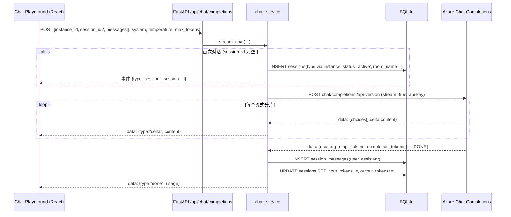

# Design Document: Azure OpenAI Testing Platform

## Overview

本设计文档描述如何将现有的 **Azure Realtime Voice Testing Management System**（仅支持语音实时测试）扩展为支持三种测试类型的 **Azure OpenAI 通用测试平台**：语音实时对话（`voice`）、大语言模型对话（`chat`）、图像生成（`image`）。

设计遵循「**扩展而非重写**」原则，完全复用现有前后端分离架构与技术栈：

- **后端**：Python 3.12 + FastAPI + aiosqlite/SQLite，位于 `azure-voice-admin/backend/app/`。沿用「API 路由层 → Service 服务层 → Pydantic 模型 → SQLite」的分层结构。
- **前端**：TypeScript + React 19 + Vite + Tailwind v4 + Radix UI + recharts + lucide-react，位于 `azure-voice-admin/frontend/src/`。沿用 React Router 路由、`useApi` 数据获取、彩色渐变（gradient）视觉风格。

核心设计目标：

- 在已有 `instances` 表新增 `type` 字段（`voice` | `chat` | `image`），实例创建时选定类型且创建后不可变；界面按实例类型路由到对应 Playground。
- 复用现有 `sessions` + `session_messages` 表承载 `chat` 会话；新增 `image_generations` 表承载图像生成元数据；图像文件落盘到 `Data_Dir`。
- `voice` / `chat` / `image` 三种类型共享统一的历史记录（Unified_History）与仪表盘（Unified_Dashboard），支持按类型 / 实例筛选与聚合。
- 启动时执行**幂等的向后兼容迁移**，将既有语音实例默认标记为 `voice`，保证既有数据不丢失、既有语音功能不受影响。
- 不引入身份认证机制，保持与现有系统一致的本地开发者工具定位。

## Architecture

### 系统架构图（扩展后）

在现有架构（LiveKit + Agent Worker 子进程负责 voice）基础上，新增两条**直连 Azure OpenAI**的请求链路：`chat` 通过 FastAPI 流式代理，`image` 通过 FastAPI 同步代理并落盘。这两条链路不依赖 LiveKit，也不再 spawn 子进程。

```
┌──────────────────────────────────────────────────────────────────────┐
│                              用户浏览器                                 │
│  ┌────────────────────────────────────────────────────────────────┐   │
│  │                 React SPA (Vite + TypeScript)                    │   │
│  │  ┌────────┐ ┌─────────┐ ┌──────────┐ ┌──────────┐ ┌─────────┐ │   │
│  │  │Dashboard│ │Instances│ │  Voice   │ │   Chat   │ │  Image  │ │   │
│  │  │(统一)   │ │(带类型) │ │Playground│ │Playground│ │Playground││   │
│  │  └────────┘ └─────────┘ └──────────┘ └──────────┘ └─────────┘ │   │
│  │                          ┌──────────────────────┐              │   │
│  │                          │  Unified History     │              │   │
│  │                          └──────────────────────┘              │   │
│  └──────┬───────────────┬───────────────┬───────────────┬─────────┘   │
│         │REST API       │WS+LiveKit(voice)│fetch stream  │multipart    │
│         │               │                │(chat SSE)    │(image)       │
└─────────┼───────────────┼────────────────┼──────────────┼─────────────┘
          │               │                │              │
┌─────────┼───────────────┼────────────────┼──────────────┼─────────────┐
│         ▼               ▼                ▼              ▼             │
│  ┌──────────────────────────────────────────────────────────────┐   │
│  │                  FastAPI Server (port 8090)                    │   │
│  │  /api/instances  /api/sessions  /api/chat  /api/images         │   │
│  │  /api/history    /api/dashboard  WS /ws/sessions/{id}/logs      │   │
│  └───┬───────────────┬──────────────────┬──────────────┬──────────┘   │
│      │               │                  │              │              │
│      ▼               ▼                  ▼              ▼              │
│ ┌─────────┐  ┌──────────────┐  ┌──────────────┐ ┌──────────────┐    │
│ │ SQLite  │  │ Agent Worker │  │ chat_service │ │image_service │    │
│ │instances│  │ (voice 子进程)│  │ (aiohttp流式)│ │(aiohttp+落盘)│    │
│ │sessions │  └──────┬───────┘  └──────┬───────┘ └──────┬───────┘    │
│ │session_ │         │                 │                │            │
│ │ messages│    LiveKit Server         │                ▼            │
│ │image_   │         │                 │        ┌────────────────┐   │
│ │generat. │         ▼                 │        │  Data_Dir      │   │
│ └─────────┘  Azure Realtime           │        │ data/images/…  │   │
│                                       ▼        └────────────────┘   │
└───────────────────────────────┬──────┴─────────────────────────────┘
                                 ▼
              ┌──────────────────────────────────────────┐
              │            Azure OpenAI API               │
              │  Realtime(wss) | Chat Completions(stream) │
              │  Images generations / edits               │
              └──────────────────────────────────────────┘
```

### 数据流说明

1. **Voice 流（沿用现有）**：`POST /api/sessions` → 创建 LiveKit 房间 + Token → spawn Agent Worker 子进程 → 浏览器 ↔ LiveKit ↔ Agent ↔ Azure Realtime；调试日志经 stderr → LogBroadcaster → `WS /ws/sessions/{id}/logs`。
2. **Chat 流（新增）**：`POST /api/chat/completions`（首条消息时惰性创建 `sessions` 记录）→ `chat_service` 用 aiohttp 以 `stream=true` 调用 Azure Chat Completions → 后端边接收边通过 `StreamingResponse`（`text/event-stream`）把 token 转发给前端 → 前端逐字渲染 → 流结束后累加 usage、持久化 `session_messages` 与 token 用量。
3. **Image 流（新增）**：`POST /api/images/generations`（`multipart/form-data`，可含参考图）→ `image_service` 调 Azure Images `generations`（无参考图）或 `edits`（有参考图）→ 解码返回的图片写入 `data/images/<generation_id>/<index>.<ext>` → 写入 `image_generations` 元数据 → 返回图片可访问 URL；图片经 `GET /api/images/{generation_id}/{index}` 提供。
4. **统一历史 / 仪表盘流（新增）**：`GET /api/history` 合并 `sessions`（voice/chat，类型取自 `instances.type`）与 `image_generations`（image），按开始时间倒序分页；`GET /api/dashboard/*` 跨两张表聚合用量，支持按类型 / 实例筛选。

### Chat 流式时序图



### Image 生成时序图（含参考图编辑分支）

```mermaid
sequenceDiagram
    participant UI as Image Playground (React)
    participant API as FastAPI /api/images/generations
    participant SVC as image_service
    participant AZ as Azure Images API
    participant FS as Data_Dir (文件系统)
    participant DB as SQLite

    UI->>API: multipart {instance_id, prompt, size, quality, compression, output_format, n, image?}
    API->>SVC: generate(...)
    alt 附带参考图
        SVC->>AZ: POST images/edits?api-version (multipart: image, prompt, ...)
    else 无参考图
        SVC->>AZ: POST images/generations?api-version (json: prompt, size, quality, n, ...)
    end
    AZ-->>SVC: {data:[{b64_json}...], usage}
    SVC->>FS: mkdir data/images/<gen_id>/; 写入 <index>.<ext>
    alt 写文件成功
        SVC->>DB: INSERT image_generations(prompt, params, usage, image_paths[])
        SVC-->>UI: {generation_id, images:[/api/images/<gen_id>/0 ...], usage}
    else 写文件失败
        SVC->>FS: 清理已写入的部分文件
        SVC-->>UI: 500 错误 (不写入悬空元数据)
    end
```

## Components and Interfaces

### 后端组件

#### 1. 配置模块 (`backend/app/config.py`，新增)

集中读取 Azure OpenAI 相关配置，满足需求 9.4（api-version 来自配置而非硬编码）：

```python
import os

# Chat 与 Image 使用的 Azure API 版本（可分别配置，均有默认值）
AZURE_OPENAI_CHAT_API_VERSION = os.environ.get(
    "AZURE_OPENAI_CHAT_API_VERSION", "2024-10-21"
)
AZURE_OPENAI_IMAGE_API_VERSION = os.environ.get(
    "AZURE_OPENAI_IMAGE_API_VERSION", "2025-04-01-preview"
)

# 图像文件存储根目录，默认与 SQLite 同级（Data_Dir）
DATA_DIR = os.environ.get("DATA_DIR", "./data")
IMAGES_DIR_NAME = "images"

# 单个请求 / 单张图片体积上限（防御性）
MAX_REFERENCE_IMAGE_BYTES = 50 * 1024 * 1024  # 50MB
```

> 说明：api-version 优先读取环境变量；如需按实例覆盖，可在后续通过一次幂等 `ALTER TABLE instances ADD COLUMN api_version` 扩展，本期以全局环境变量为准（[假设]）。

#### 2. Instance API (`backend/app/api/instances.py`，扩展)

沿用现有 5 个端点，请求 / 响应模型新增 `type` 字段；新增按类型筛选查询参数：

```python
GET    /api/instances?type=voice|chat|image   # 列表，可选按类型筛选（需求 1.8）
POST   /api/instances                          # 创建，必须携带合法 type（需求 1.1/1.2）
GET    /api/instances/{id}                      # 详情（含脱敏 key、按类型汇总用量）
PUT    /api/instances/{id}                      # 更新，忽略/拒绝 type 变更（需求 1.7）
DELETE /api/instances/{id}                      # 删除（有活跃会话时拒绝；级联清理图像文件）
```

#### 3. Chat API (`backend/app/api/chat.py`，新增)

```python
# 流式对话代理（SSE 风格，text/event-stream）
POST   /api/chat/completions
# 请求体 ChatCompletionRequest：
#   instance_id: str
#   session_id: str | None          # 为空则惰性创建新会话
#   messages: list[ChatMessage]     # 累积的多轮上下文（需求 2.3）
#   system_prompt: str | None
#   temperature: float = 1.0        # 服务端二次约束到 [0, 2]（需求 2.5）
#   max_tokens: int | None          # 服务端约束为正整数（需求 2.6）
# 响应：StreamingResponse(media_type="text/event-stream")
#   逐行 data: {"type": "session", "session_id": "..."}
#           data: {"type": "delta", "content": "..."}
#           data: {"type": "done", "usage": {...}}
#           data: {"type": "error", "message": "..."}
```

**为什么选 SSE / `StreamingResponse` 而非 WebSocket**：

- Chat 本质是「一次请求 → 一段流式响应」的请求/响应模型，与需要长期双向通道的 voice 调试日志（现有 `WS /ws/sessions/{id}/logs`）不同。
- 需要在请求体中提交完整多轮上下文与参数，体积较大，不适合浏览器原生 `EventSource`（仅支持 GET + query）。因此采用 **POST + `StreamingResponse`（`text/event-stream`）**，前端用 `fetch` + `ReadableStream` reader 消费。
- 复用现有 `/api/*` REST 约定与 uvicorn/Caddy 反代，无需管理额外的 WebSocket 生命周期。WebSocket 继续专用于持续时间跨越多次请求的 voice 日志通道。

#### 4. Image API (`backend/app/api/images.py`，新增)

```python
# 图像生成 / 编辑（multipart 以支持可选参考图）
POST   /api/images/generations
# Form 字段：instance_id, prompt, size, quality, output_format,
#            compression(0-100), n；可选 file: image（参考图 → 走 edits）
# 响应 ImageGenerationResponse：{generation_id, images: [url...], usage, params}

GET    /api/images/{generation_id}/{index}     # 提供已存图片文件（带路径穿越防护）
DELETE /api/images/{generation_id}             # 删除元数据 + 磁盘文件（需求 5.4）
GET    /api/images?instance_id=&page=&page_size=  # 图像生成历史列表
GET    /api/images/{generation_id}             # 图像生成详情（prompt/params/usage/图片）
```

> 依赖说明：FastAPI 处理 `multipart/form-data` 需要新增 `python-multipart` 依赖（加入 `pyproject.toml`）。

#### 5. Unified History API (`backend/app/api/history.py`，新增)

```python
GET /api/history?type=&instance_id=&page=&page_size=
# 合并 sessions(voice/chat) 与 image_generations(image)，按 start_time 倒序分页
# 响应 PaginatedHistory：{items: list[HistoryItem], total, page, page_size}
# HistoryItem 统一字段：{id, type, instance_id, instance_name, title/preview,
#                        start_time, input_tokens, output_tokens, status}
```

#### 6. Dashboard API (`backend/app/api/dashboard.py`，扩展)

```python
GET /api/dashboard/stats?type=&instance_id=          # 跨类型聚合总量（可筛选）
GET /api/dashboard/usage-by-instance?type=           # 按实例聚合（含类型分布）
GET /api/dashboard/usage-by-type                     # 按类型聚合（voice/chat/image）
```

聚合口径：`sessions` 表贡献 voice/chat 用量，`image_generations` 表贡献 image 用量；`total_tests = COUNT(sessions) + COUNT(image_generations)`。空筛选返回零值而非报错（需求 7.5）。

#### 7. Chat 服务层 (`backend/app/services/chat_service.py`，新增)

参照 `session_service` 风格，负责会话生命周期与 Azure 流式调用：

```python
class ChatService:
    async def stream_chat(
        self, db, req: ChatCompletionRequest
    ) -> AsyncGenerator[str, None]:
        """惰性创建/复用 chat 会话，流式代理 Azure Chat Completions，
        累计 token 并持久化消息。逐条 yield SSE 文本行。"""

    async def new_conversation(self, db, instance_id: str) -> str:
        """创建新的 chat 会话记录，status='active'，返回 session_id（需求 2.7）。"""

    @staticmethod
    def _clamp_temperature(value: float) -> float:
        """约束到 [0.0, 2.0]（需求 2.5）。"""
        return max(0.0, min(2.0, value))

    @staticmethod
    def _sanitize_max_tokens(value: int | None) -> int | None:
        """None 透传；否则约束为正整数（需求 2.6）。"""

    def _azure_chat_url(self, endpoint: str, deployment: str) -> str:
        """{endpoint}/openai/deployments/{deployment}/chat/completions
           ?api-version={AZURE_OPENAI_CHAT_API_VERSION}"""
```

**Azure Chat Completions 调用要点**：
- URL：`{endpoint}/openai/deployments/{deployment}/chat/completions?api-version=...`
- 请求头：`api-key: {instance.api_key}`、`Content-Type: application/json`
- 请求体：`{"messages": [...], "temperature": <clamped>, "max_tokens": <int|None>, "stream": true, "stream_options": {"include_usage": true}}`；`system_prompt` 作为首条 `{"role":"system"}` 注入。
- 用 `aiohttp.ClientSession` 逐块读取 `data:` 行，累积 `delta.content`；末尾分片的 `usage` 提供 `prompt_tokens` / `completion_tokens`。若未返回 usage，则记为 0（需求 3.6）。

#### 8. Image 服务层 (`backend/app/services/image_service.py`，新增)

```python
class ImageService:
    async def generate(
        self, db, req: ImageGenerationRequest, reference: UploadFile | None
    ) -> ImageGenerationResponse:
        """调用 Azure Images generations/edits，落盘图片并写入元数据。
        写文件失败时清理已写文件且不写悬空元数据（需求 5.5）。"""

    async def delete_generation(self, db, generation_id: str) -> None:
        """删除元数据记录与磁盘上对应目录下所有图片文件（需求 5.4）。"""

    def resolve_image_path(self, generation_id: str, index: int) -> Path:
        """解析磁盘路径，并校验落在 images 根目录内（防路径穿越）。"""

    @staticmethod
    def _clamp_compression(value: int) -> int:
        """约束到 [0, 100]（需求 4.7）。"""
        return max(0, min(100, value))
```

**Azure Images 调用要点**：
- 生成（无参考图）：`POST {endpoint}/openai/deployments/{deployment}/images/generations?api-version=...`，JSON：`{prompt, size, quality, n, output_format, output_compression}`。
- 编辑 / 变体（有参考图）：`POST {endpoint}/openai/deployments/{deployment}/images/edits?api-version=...`，`multipart/form-data`：`image` + `prompt` + 参数（需求 4.3）。
- 请求头：`api-key: {instance.api_key}`。
- 响应：`{"data": [{"b64_json": "..."}...], "usage": {"input_tokens", "output_tokens", "total_tokens"}}`；`n>1` 时 `data` 含多张（需求 4.6/5 中的多变体）。`output_compression` 仅在 `output_format` 为 `webp`/`jpeg` 时生效（[基于官方文档，已改写以符合许可要求]，参见 [OpenAI Images API 参考](https://developers.openai.com/api/reference/cli/resources/images/methods/generate)）。
- 将每张 `b64_json` 解码后写入 `data/images/<generation_id>/<index>.<output_format>`。

#### 9. 错误处理与密钥脱敏（横切）

- 复用 `InstanceService.mask_api_key`；chat/image service 在日志与响应中一律不写完整 api-key（需求 9.3）。
- 所有 Azure 调用捕获异常与非 2xx 状态，转换为可读错误：chat 通过 SSE `{"type":"error"}` 下发，image 返回 HTTP 4xx/5xx；前端展示且不崩溃当前视图（需求 9.2）。

### 前端组件

#### 页面路由（`App.tsx` 扩展）

| 路径 | 页面 | 说明 |
|------|------|------|
| `/` | Dashboard | 统一仪表盘（新增类型筛选） |
| `/instances` | Instance List | 实例列表（新增类型徽章 + 类型筛选） |
| `/instances/new` `/instances/:id` | Instance Form | 新建/编辑（新增类型选择器，编辑时禁用） |
| `/sessions/new?instance=:id` | Voice Playground | 现有语音测试（type=voice） |
| `/chat/new?instance=:id` | **Chat Playground** | 多轮流式对话（type=chat，新增） |
| `/images/new?instance=:id` | **Image Playground** | 图像生成（type=image，新增） |
| `/history` | Unified History | 统一历史（新增类型筛选 + 徽章） |
| `/history/:id` | Session Detail | voice/chat 详情（chat 展示对话转写） |
| `/history/image/:id` | **Image Detail** | 图像生成详情（图片 + 参数 + usage，新增） |

实例打开逻辑：`InstanceCard` 的「开始」按钮按 `instance.type` 跳转到 `/sessions/new` / `/chat/new` / `/images/new`（需求 1.3–1.5）。

#### 核心前端组件（新增标注 ＋）

```
components/
├── instances/
│   ├── InstanceForm.tsx      # ＋类型选择器（create 可选，edit 禁用 → 需求 1.7）
│   ├── InstanceCard.tsx      # ＋类型徽章、按类型路由
│   └── TypeBadge.tsx         # ＋类型徽章（voice/chat/image 三色渐变）
├── chat/                     # ＋整目录新增
│   ├── ChatMessageList.tsx   #   多轮气泡列表（流式渲染 assistant token）
│   ├── ChatBubble.tsx        #   单条消息气泡
│   ├── ChatComposer.tsx      #   底部输入框 + 发送 + 新对话
│   └── ChatParamsPanel.tsx   #   system prompt / temperature(0-2) / max_tokens 面板
├── image/                    # ＋整目录新增
│   ├── ImagePromptBar.tsx    #   prompt 输入 + 内联 size/quality 选择 + 生成按钮
│   ├── ImageParamsPanel.tsx  #   compression(0-100)/format/variations 滑块 + 附参考图
│   ├── ImageResultGrid.tsx   #   结果网格（多变体）
│   └── ImageEmptyState.tsx   #   空态 "Generate an image to get started"（需求 4.4）
├── history/
│   ├── SessionList.tsx       # ＋类型徽章列
│   ├── HistoryFilter.tsx     # ＋类型 + 实例筛选
│   └── ImageDetail.tsx       # ＋图像详情视图
└── dashboard/
    └── (复用 StatsCard/UsageChart/TokenDonutChart/SessionsChart，＋类型筛选)
```

所有新增页面沿用现有彩色渐变风格（如 `bg-gradient-to-r from-indigo-600 to-violet-500` 标题、卡片渐变强调条、圆角阴影），满足需求 9.1。

#### 自定义 Hooks

```typescript
// hooks/useChatStream.ts（新增）—— 用 fetch + ReadableStream 消费 SSE
function useChatStream(): {
  messages: ChatMessage[];        // 含流式增量拼接的 assistant 消息
  streaming: boolean;
  usage: TokenUsage | null;
  sessionId: string | null;
  sendMessage: (text: string, params: ChatParams) => Promise<void>;
  newConversation: () => void;    // 清空上下文并开启新会话（需求 2.7）
  error: string | null;
}

// hooks/useApi.ts（复用现有）
```

`useChatStream` 消费逻辑：`fetch('/api/chat/completions', {method:'POST', body})` → `res.body.getReader()` → `TextDecoder` 逐块解析 `data:` 行 → 按 `type` 分发：`session` 记录 sessionId、`delta` 追加到当前 assistant 气泡（逐字渲染，需求 2.2）、`done` 记录 usage、`error` 展示错误。

## Data Models

### 数据库 Schema 变更 (SQLite)

在既有 `instances` / `sessions` / `session_logs` / `session_messages` 基础上：新增 `instances.type` 列，新增 `image_generations` 表。`sessions` 表结构不变，`chat` 会话直接复用（voice 专属列如 `room_name` 对 chat 置为空串 `''`，其 NOT NULL 约束仅禁止 NULL、允许空串）。

```sql
-- instances 新增列（fresh DB 走 schema.sql；既有 DB 走启动迁移 ALTER）
ALTER TABLE instances ADD COLUMN type TEXT NOT NULL DEFAULT 'voice';
-- 取值约束在应用层校验：voice | chat | image

-- 图像生成元数据表（幂等创建）
CREATE TABLE IF NOT EXISTS image_generations (
    id TEXT PRIMARY KEY DEFAULT (lower(hex(randomblob(16)))),
    instance_id TEXT NOT NULL REFERENCES instances(id),
    session_id TEXT REFERENCES sessions(id) ON DELETE SET NULL,  -- 可选分组，通常为 NULL
    prompt TEXT NOT NULL,
    params TEXT NOT NULL DEFAULT '{}',   -- JSON: {size, quality, output_format, compression, n, mode}
    size TEXT,
    quality TEXT,
    output_format TEXT,
    compression INTEGER,
    n INTEGER DEFAULT 1,
    has_reference INTEGER NOT NULL DEFAULT 0,   -- 0/1，是否为参考图编辑
    input_tokens INTEGER DEFAULT 0,
    output_tokens INTEGER DEFAULT 0,
    image_paths TEXT NOT NULL DEFAULT '[]',     -- JSON 数组：相对 Data_Dir 的图片路径
    status TEXT NOT NULL DEFAULT 'completed',   -- completed | error
    error_message TEXT,
    created_at TEXT NOT NULL DEFAULT (datetime('now'))
);

CREATE INDEX IF NOT EXISTS idx_image_generations_instance_id ON image_generations(instance_id);
CREATE INDEX IF NOT EXISTS idx_image_generations_created_at ON image_generations(created_at DESC);
```

> `chat` 会话的类型不落在 `sessions` 表，而是通过 `sessions.instance_id → instances.type` JOIN 派生（`instances.type` 创建后不可变，JOIN 可靠）。统一历史/仪表盘据此区分 voice 与 chat。

### 迁移策略 (`backend/app/database.py` 扩展)

在 `init_db()` 内、执行完 `schema.sql` 后追加**幂等迁移**逻辑，满足需求 8：

```python
async def _migrate(db: aiosqlite.Connection) -> None:
    """幂等的向后兼容迁移。任何失败都抛出以中止启动（需求 8.5）。"""
    # 1) instances.type：存在性检查后再 ADD COLUMN（SQLite 无 IF NOT EXISTS for column）
    cursor = await db.execute("PRAGMA table_info(instances)")
    cols = {row[1] for row in await cursor.fetchall()}
    if "type" not in cols:
        # ADD COLUMN 携带 NOT NULL + DEFAULT 'voice'：既有行自动填 'voice'（需求 8.1/8.2）
        await db.execute(
            "ALTER TABLE instances ADD COLUMN type TEXT NOT NULL DEFAULT 'voice'"
        )
    # 2) image_generations 表已在 schema.sql 中以 IF NOT EXISTS 创建（幂等，需求 8.3）
    await db.commit()


async def init_db() -> None:
    db_path = Path(DB_PATH)
    db_path.parent.mkdir(parents=True, exist_ok=True)
    async with aiosqlite.connect(str(db_path)) as db:
        await db.execute("PRAGMA journal_mode=WAL")
        await db.execute("PRAGMA foreign_keys = ON")
        schema_sql = _SCHEMA_PATH.read_text(encoding="utf-8")
        await db.executescript(schema_sql)   # 含 image_generations 的 IF NOT EXISTS
        try:
            await _migrate(db)                # 幂等 ALTER；失败则向上抛出
        except Exception as exc:
            logging.getLogger("azure_openai_admin").error(
                "Schema migration failed, halting startup: %s", exc
            )
            raise                             # 中止启动，避免半迁移状态（需求 8.5）
        await db.commit()
```

**SQLite `ADD COLUMN` 限制说明**：
- SQLite 不支持 `ADD COLUMN IF NOT EXISTS`，因此先用 `PRAGMA table_info` 做存在性检查再 ALTER，保证重复启动幂等（需求 8.3）。
- `ADD COLUMN` 若声明 `NOT NULL` 必须提供 `DEFAULT`（此处为 `'voice'`），既有行由该默认值回填（需求 8.2）。
- SQLite 无法在 `ADD COLUMN` 时添加 `CHECK`/`UNIQUE` 约束，故 `type` 的取值范围（voice/chat/image）由应用层（`InstanceService`）校验。
- 既有语音数据（instances/sessions/messages/logs）不被删除或改写，语音功能保持可用（需求 8.4/6.6）。

### Pydantic Models (Backend)

```python
# ---- Instance（扩展 type） ----
InstanceType = Literal["voice", "chat", "image"]

class InstanceCreate(BaseModel):
    name: str
    endpoint: str
    api_key: str
    deployment: str
    type: InstanceType            # 必填；缺失/非法 → 422（需求 1.1/1.2）
    description: str = ""

class InstanceUpdate(BaseModel):
    name: str | None = None
    endpoint: str | None = None
    api_key: str | None = None
    deployment: str | None = None
    description: str | None = None
    # 注意：无 type 字段 —— type 创建后不可变（需求 1.7）

class InstanceSummary(BaseModel):
    id: str; name: str; endpoint: str; deployment: str
    type: InstanceType; description: str; created_at: str

class InstanceDetail(InstanceSummary):
    api_key_masked: str; updated_at: str
    total_sessions: int; total_input_tokens: int; total_output_tokens: int

# ---- Chat ----
class ChatMessage(BaseModel):
    role: Literal["system", "user", "assistant"]
    content: str

class ChatCompletionRequest(BaseModel):
    instance_id: str
    session_id: str | None = None
    messages: list[ChatMessage]
    system_prompt: str | None = None
    temperature: float = 1.0      # 服务端 clamp 到 [0,2]
    max_tokens: int | None = None # 服务端约束为正整数

class ChatMessageRecord(BaseModel):
    id: int; session_id: str
    role: Literal["user", "assistant"]; content: str; timestamp: str

# ---- Image ----
class ImageParams(BaseModel):
    size: str = "1024x1024"
    quality: Literal["low", "medium", "high"] = "high"
    output_format: str = "png"        # 至少支持 png
    compression: int = 100            # clamp 到 [0,100]
    n: int = 1                        # >=1

class ImageGenerationResponse(BaseModel):
    generation_id: str
    instance_id: str
    prompt: str
    params: ImageParams
    images: list[str]                 # 可访问 URL：/api/images/{id}/{index}
    input_tokens: int
    output_tokens: int
    has_reference: bool
    created_at: str

# ---- 统一历史 ----
class HistoryItem(BaseModel):
    id: str
    type: InstanceType
    instance_id: str
    instance_name: str
    title: str                        # chat: 首条用户消息摘要；image: prompt 摘要；voice: room_name
    start_time: str
    input_tokens: int
    output_tokens: int
    status: str

class PaginatedHistory(BaseModel):
    items: list[HistoryItem]; total: int; page: int; page_size: int

# ---- Dashboard（扩展类型维度） ----
class DashboardStats(BaseModel):
    total_instances: int
    total_tests: int                  # sessions + image_generations
    active_sessions: int
    total_input_tokens: int
    total_output_tokens: int

class TypeUsage(BaseModel):
    type: InstanceType
    test_count: int
    total_input_tokens: int
    total_output_tokens: int
```

### TypeScript Types (Frontend, `src/types/index.ts` 扩展)

```typescript
export type InstanceType = 'voice' | 'chat' | 'image';

export interface Instance {
  id: string; name: string; endpoint: string; deployment: string;
  type: InstanceType;              // 新增
  description: string; created_at: string;
}

export interface ChatMessage { role: 'system' | 'user' | 'assistant'; content: string; }
export interface ChatParams { system_prompt: string; temperature: number; max_tokens: number | null; }
export interface TokenUsage { input_tokens: number; output_tokens: number; }

export interface ImageParams {
  size: string;
  quality: 'low' | 'medium' | 'high';
  output_format: string;
  compression: number;             // 0-100
  n: number;                       // >=1
}

export interface ImageGeneration {
  generation_id: string; instance_id: string; prompt: string;
  params: ImageParams; images: string[];
  input_tokens: number; output_tokens: number;
  has_reference: boolean; created_at: string;
}

export interface HistoryItem {
  id: string; type: InstanceType; instance_id: string; instance_name: string;
  title: string; start_time: string;
  input_tokens: number; output_tokens: number; status: string;
}

export interface PaginatedHistory {
  items: HistoryItem[]; total: number; page: number; page_size: number;
}
```

### 文件存储布局 (Data_Dir)

```
data/                              # DATA_DIR（与 SQLite voice_admin.db 同级）
├── voice_admin.db                 # 现有 SQLite（含 WAL 文件）
└── images/                        # 图像根目录
    └── <generation_id>/           # 每次生成一个目录
        ├── 0.png
        ├── 1.png                  # n>1 时的多变体
        └── ...
```

- 图片写入采用「先写文件、成功后再写元数据」的顺序；若任一文件写入失败，清理该 `generation_id` 目录并返回错误，不写入引用缺失文件的元数据（需求 5.5）。
- 删除生成记录时，先删磁盘目录再删数据库行（需求 5.4）；删除实例时级联清理其名下所有图像目录。
- `image_paths` 存储相对 `images/` 的路径，`resolve_image_path` 解析后校验绝对路径以 images 根目录为前缀（防路径穿越，见需求 9 安全说明）。

## Correctness Properties

*A property is a characteristic or behavior that should hold true across all valid executions of a system—essentially, a formal statement about what the system should do. Properties serve as the bridge between human-readable specifications and machine-verifiable correctness guarantees.*

### Property 1: 实例类型往返一致性

*For any* instance created with a valid Instance_Type in {`voice`, `chat`, `image`}, reading the instance back from the Instance_Store SHALL return exactly the same Instance_Type value that was persisted.

**Validates: Requirements 1.1**

### Property 2: 非法或缺失类型被拒绝

*For any* instance creation request whose `type` is missing, empty, or not one of {`voice`, `chat`, `image`}, the Testing_Platform SHALL reject the request with a validation error and SHALL NOT persist the instance.

**Validates: Requirements 1.2**

### Property 3: 实例类型创建后不可变

*For any* existing instance and any update request, the persisted Instance_Type after the update SHALL equal the Instance_Type before the update (the type is never changed by an update).

**Validates: Requirements 1.7**

### Property 4: 按类型筛选正确性

*For any* set of instances (or unified history entries) and any selected type filter value, the filtered result SHALL contain exactly the records whose type matches the filter and none with a different type.

**Validates: Requirements 1.8, 6.3, 7.2**

### Property 5: temperature 参数区间约束

*For any* real-valued temperature input, the value used for the Azure request SHALL be clamped into the closed range [0, 2]: inputs below 0 become 0, inputs above 2 become 2, and in-range inputs are unchanged.

**Validates: Requirements 2.5**

### Property 6: max_tokens 参数约束为正整数

*For any* provided max_tokens value, the value used for the Azure request SHALL be a positive integer (values ≤ 0 are rejected or coerced to a positive value); a null/omitted value is passed through unchanged.

**Validates: Requirements 2.6**

### Property 7: compression 参数区间约束

*For any* integer compression input, the value used for the image request SHALL be clamped into the closed range [0, 100].

**Validates: Requirements 4.7**

### Property 8: 对话 Token 用量累加一致性

*For any* sequence of chat turns within a Chat_Session, the total input_tokens and output_tokens persisted for that session SHALL equal the sum of the per-turn input and output token counts respectively; turns that return no usage contribute zero.

**Validates: Requirements 3.3, 3.6**

### Property 9: 对话消息持久化完整性

*For any* completed chat turn, the Session_Store SHALL persist both the user message and the assistant message, each with a non-empty role in {`user`, `assistant`}, its content, and a timestamp.

**Validates: Requirements 3.2**

### Property 10: 会话删除级联清理消息

*For any* Chat_Session, deleting the session record SHALL remove the session metadata and all of its associated `session_messages` rows, leaving no orphaned messages.

**Validates: Requirements 3.5**

### Property 11: 请求的变体数量与返回图片数量一致

*For any* number-of-variations n ≥ 1 in a successful image generation, the request sent to Azure SHALL ask for n images and the persisted `image_paths` SHALL contain exactly one saved file path per returned image.

**Validates: Requirements 4.6, 5.1**

### Property 12: 图像元数据完整性与无悬空引用

*For any* successfully persisted Image_Generation, the metadata record SHALL contain the prompt, the generation parameters, the usage tokens, the instance_id, and a non-empty `image_paths`; and every path in `image_paths` SHALL reference a file that exists on disk. If any image file write fails, no metadata record SHALL be persisted.

**Validates: Requirements 5.2, 5.5**

### Property 13: 图像删除清理数据库与文件

*For any* Image_Generation, deleting it SHALL remove both the database metadata row and every associated image file under the Data_Dir.

**Validates: Requirements 5.4**

### Property 14: 统一历史按开始时间降序

*For any* paginated unified history result, each entry's start_time SHALL be greater than or equal to the start_time of the subsequent entry (most recent first), regardless of the entry's type.

**Validates: Requirements 6.1**

### Property 15: 仪表盘跨类型聚合正确性

*For any* set of test records across voice/chat/image and any type/instance filter, the aggregated input and output token totals SHALL equal the sum of tokens of exactly the records matching the filter; an empty matching set SHALL yield zero totals rather than an error.

**Validates: Requirements 7.1, 7.3, 7.5**

### Property 16: 迁移幂等且默认归类为 voice

*For any* pre-existing voice-only database, running the migration once or multiple times SHALL be idempotent (no failure, no duplicate schema), SHALL preserve all existing rows, and SHALL set the Instance_Type of every pre-existing instance to `voice`.

**Validates: Requirements 8.1, 8.2, 8.3, 8.4, 6.6**

### Property 17: API Key 脱敏保留末尾字符

*For any* API key string of length ≥ 4, the mask function SHALL return a string where the last 4 characters match the original and all preceding characters are `*`; for any key of length < 4 it SHALL return `****`. The full key SHALL never appear in client responses or logs.

**Validates: Requirements 9.3**

### Property 18: 图片文件服务的路径穿越防护

*For any* requested `generation_id`/`index` combination, the resolved file path SHALL lie within the images root directory under Data_Dir; any resolved path escaping that directory SHALL be rejected and no file outside it SHALL be served.

**Validates: Requirements 9.5**

## Error Handling

### 错误分类与策略

| 错误类型 | 场景 | 处理策略 |
|---------|------|---------|
| 输入验证错误 | type 缺失/非法、字段为空、名称重名 | 返回 422 + 字段错误信息（沿用现有约定） |
| 参数越界 | temperature/compression 越界、max_tokens ≤ 0 | 服务端 clamp/校正，不报错（Property 5/6/7） |
| 资源不存在 | 查询不存在的 instance/session/generation | 返回 404 |
| 业务约束冲突 | 删除有活跃会话的实例 | 返回 409 + 冲突说明 |
| Azure Chat 调用失败 | 认证失败/超时/非 2xx | SSE 下发 `{"type":"error","message":...}`，标记会话 `error`，前端展示不崩溃（需求 9.2） |
| Azure Image 调用失败 | 认证失败/超时/非 2xx | 返回 4xx/5xx + 可读消息；不写元数据 |
| 图片落盘失败 | 磁盘写入错误 | 清理已写文件，返回 500，不写悬空元数据（需求 5.5） |
| 路径穿越尝试 | 恶意 generation_id/index | 返回 400/404，拒绝服务目录外文件（需求 9.5） |
| 迁移失败 | ALTER/CREATE 出错 | 记录详细日志并中止启动（需求 8.5） |
| 数据库操作失败 | SQLite 写入错误 | 返回 500，日志记录详情 |

### 前端错误处理

- Chat：流式过程中收到 `error` 事件时，在对话区内联提示错误并停止 streaming 状态，保留已生成内容。
- Image：生成失败时在结果区展示错误横幅，保留参数面板状态便于重试。
- 沿用现有模式：请求失败通过内联提示 / `alert` 反馈；表单校验错误内联显示在字段下方。

### 密钥安全

- 所有类型的实例响应仅返回脱敏 key（`api_key_masked`）；chat/image service 在异常日志中引用「api-key（末 4 位）」而非完整值（需求 9.3）。

## Testing Strategy

### 测试分层

```
┌───────────────────────────┐
│   Integration Tests        │  pytest + httpx.AsyncClient - 新端点端到端
├───────────────────────────┤
│   Property Tests           │  Hypothesis (Python) - 正确性属性
├───────────────────────────┤
│   Unit Tests               │  pytest（后端逻辑）/ vitest（前端）
├───────────────────────────┤
│   Build Verification       │  后端启动 + pnpm/vite build（需求 10）
└───────────────────────────┘
```

### 属性测试 (Property-Based Testing)

使用现有 dev 依赖 **Hypothesis**，每个属性至少运行 100 次迭代，测试标注对应属性编号：

```python
# Feature: azure-openai-testing-platform, Property 5: temperature 参数区间约束
@given(temp=st.floats(allow_nan=False, allow_infinity=False, min_value=-100, max_value=100))
def test_clamp_temperature_in_range(temp):
    assert 0.0 <= ChatService._clamp_temperature(temp) <= 2.0
```

适用范围（对应上文属性）：
- 参数约束纯函数：Property 5（temperature）、6（max_tokens）、7（compression）
- 脱敏函数：Property 17（复用现有 `mask_api_key` 测试模式）
- 类型往返 / 校验 / 不可变：Property 1、2、3
- 筛选 / 排序 / 聚合逻辑：Property 4、14、15
- Token 累加：Property 8
- 迁移幂等：Property 16（对临时旧库多次调用 `init_db`）
- 路径穿越防护：Property 18（对 `resolve_image_path` 生成含 `../`、绝对路径等恶意输入）

### 集成测试 (pytest + httpx.AsyncClient)

沿用 `tests/test_instances_api.py` 的临时库 fixture 模式，对 Azure 调用与文件落盘使用 mock（`aiohttp` 响应打桩、`DATA_DIR` 指向 tmp）：
- Chat：`POST /api/chat/completions` 流式响应解析、会话惰性创建、消息与用量持久化（需求 10.3）。
- Image：`POST /api/images/generations`（含/不含参考图两条分支）、`GET /api/images/{id}/{index}` 服务与路径穿越拒绝、`DELETE` 清理文件与元数据。
- 迁移：以「旧版本 schema（无 type、无 image_generations）」建库，运行 `init_db` 后断言 type 列存在且既有行为 `voice`、重复运行不报错（需求 8）。
- 统一历史 / 仪表盘：混合 voice/chat/image 数据后校验排序、类型/实例筛选、聚合口径与空态。

### 单元测试

- 后端：Service 边界条件（空列表、单记录、usage 缺失）、`_azure_chat_url` / `resolve_image_path` 构造。
- 前端：`useChatStream` 的 SSE 分片解析与增量拼接（mock `ReadableStream`）、TypeBadge/参数面板渲染、按类型路由跳转。

### 构建验证（需求 10）

- 后端：`pytest`（`tests/` 目录）全绿；FastAPI 应用可正常启动（`uvicorn` 导入无误、迁移通过）。
- 前端：`pnpm build`（Vite + TypeScript 类型检查）成功。
- 新增 `python-multipart` 依赖后同步更新 `pyproject.toml` 并验证安装。

### 测试工具配置

| 工具 | 用途 | 配置 |
|------|------|------|
| pytest | 后端测试运行 | 现有 `pyproject.toml [tool.pytest.ini_options]`（asyncio_mode=auto） |
| hypothesis | 属性测试 | `settings(max_examples=100)` |
| httpx | API 集成测试 | `ASGITransport` + `AsyncClient` |
| vitest | 前端单元测试 | 复用现有前端测试配置 |

### 安全考量（本地工具定位）

- 平台**不引入身份认证**，与现有系统一致，仅面向本地开发者使用（[假设]）。需要指出：`/api/chat/*`、`/api/images/*` 等新端点同样是**未鉴权**的——这对本地单机工具可接受，但若将服务暴露到网络需自行增加鉴权与访问控制。
- 图片服务端点 `GET /api/images/{generation_id}/{index}` **必须**通过 `resolve_image_path` 做前缀校验，仅提供 `Data_Dir/images` 目录内文件，杜绝 `../` 路径穿越（Property 18）。
- 所有对外响应与日志一律脱敏 api-key（Property 17）。
