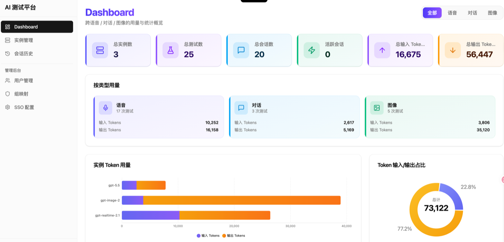
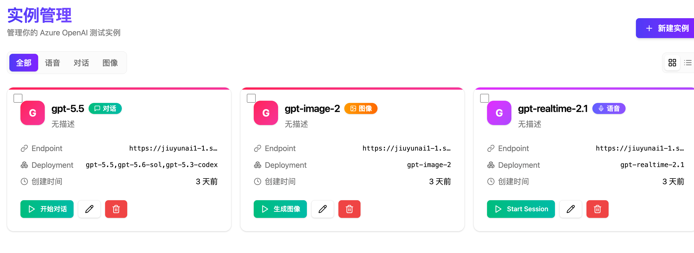
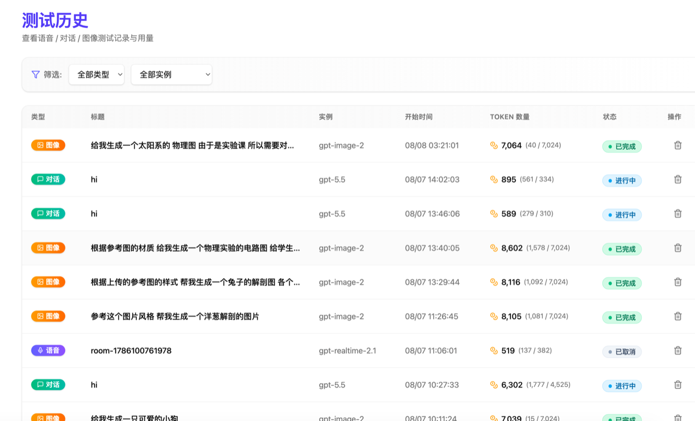
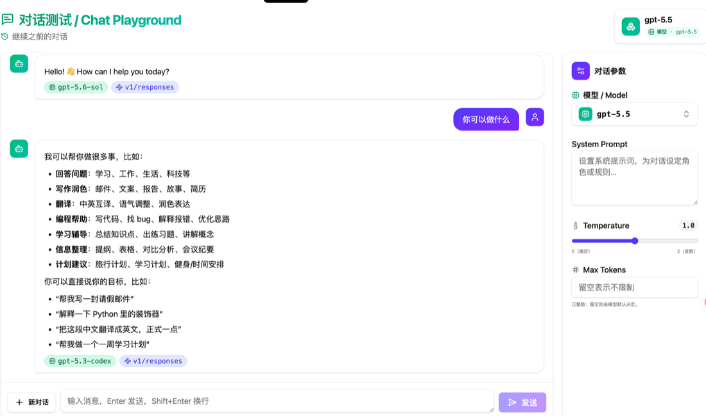
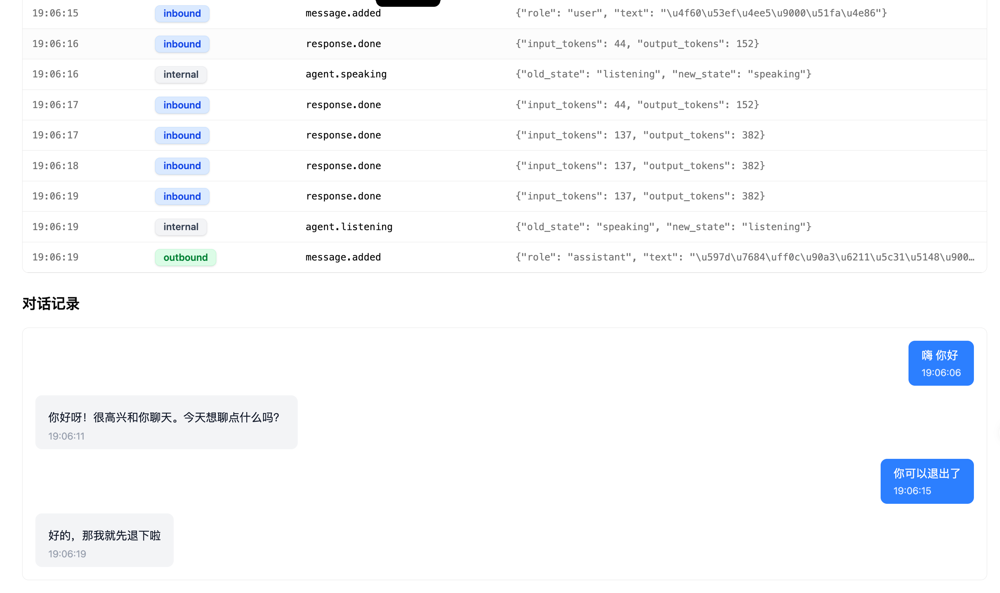
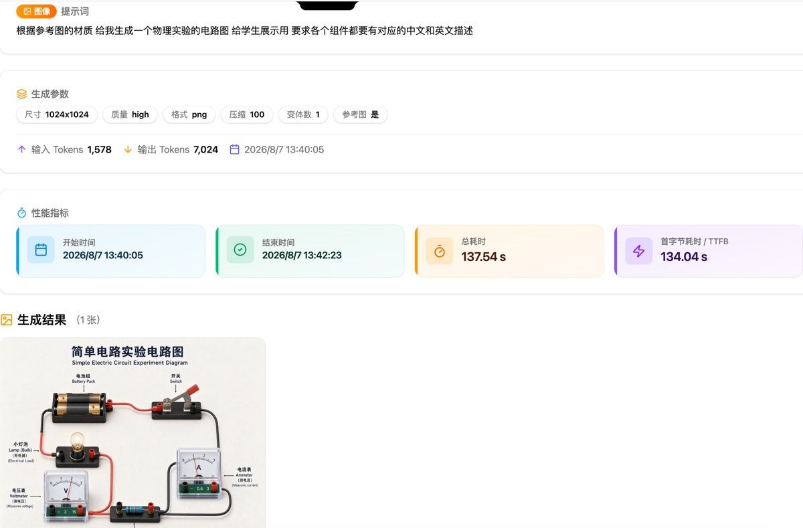
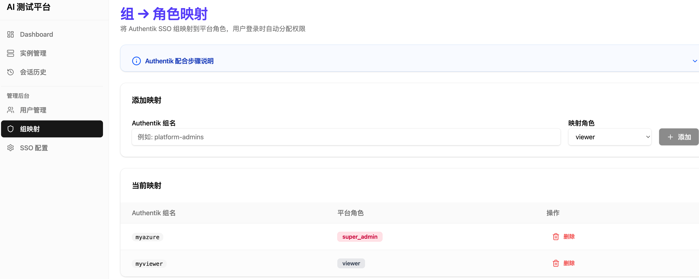

# Azure Voice Testing Admin

Azure OpenAI 多模态测试管理平台 — 支持语音对话、文本聊天、图片生成，内置用户认证与 RBAC 权限管理。

## 系统截图

### Dashboard



### 实例管理



### 会话历史



### Chat 对话详情



### 语音会话详情



### 图片生成详情



### SSO 组映射



## 功能特性

- 🎙️ **实时语音对话** — Azure OpenAI Realtime API 双向语音交互（8 种音色）
- 💬 **Chat Playground** — 文本对话，Markdown / 代码高亮 / 数学公式 / Mermaid 图表
- 🎨 **Image Generation** — 图片生成，支持参考图上传
- 📦 **多实例管理** — 多个 Azure 端点 / 密钥 / 模型独立配置
- 📊 **Dashboard 统计** — Token 用量追踪，按实例 / 类型分类
- 📜 **会话历史** — 语音 / Chat / 图片会话记录与详情回放
- 🔐 **用户认证** — 本地账号 + OIDC SSO + SAML 2.0 + SCIM v2
- 👥 **RBAC 权限** — 四级角色（super_admin / admin / tester / viewer）
- 🐳 **Docker 一键部署** — Caddy + FastAPI + LiveKit 容器化

## 快速开始

```bash
cd azure-voice-admin

# 配置
cp .env.production.example .env.production

# 构建 & 启动
./build.sh
docker compose up -d
```

访问 `http://localhost`，使用默认管理员账号登录：

| 用户名 | 密码 | 说明 |
|--------|------|------|
| `admin` | `ChangeMe@2024` | 首次登录需强制修改密码 |

## 技术栈

| 层 | 技术 |
|----|------|
| 前端 | React 19 + TypeScript + Vite + shadcn/ui + TailwindCSS v4 |
| 后端 | Python 3.12 + FastAPI + aiosqlite + bcrypt |
| 数据库 | SQLite（WAL 模式，零外部依赖） |
| 语音 | LiveKit Server + LiveKit Agent SDK |
| 反向代理 | Caddy（自动 HTTPS） |
| 容器化 | Docker Compose |
| 代码质量 | pre-commit + Ruff + Commitizen |

## 本地开发

```bash
# 后端
cd azure-voice-admin/backend
python -m venv .venv && source .venv/bin/activate
pip install -e ".[dev]"
uvicorn app.main:app --reload --port 8090

# 前端
cd azure-voice-admin/frontend
pnpm install && pnpm dev
```

## 测试

```bash
# 后端（271 个测试）
cd azure-voice-admin/backend && pytest

# 前端（58 个测试）
cd azure-voice-admin/frontend && pnpm test
```

## 项目结构

```
├── azure-voice-admin/
│   ├── backend/
│   │   ├── app/
│   │   │   ├── api/            # REST API + WebSocket
│   │   │   ├── services/       # 业务逻辑（Auth, RBAC, SSO, SAML, Chat, Image）
│   │   │   ├── models/         # Pydantic 数据模型
│   │   │   ├── agent_worker.py # LiveKit AI Agent
│   │   │   ├── database.py     # SQLite + 迁移
│   │   │   └── schema.sql      # 数据库 Schema
│   │   └── tests/              # 271 个测试
│   ├── frontend/
│   │   ├── src/pages/          # 页面组件
│   │   ├── src/components/     # UI 组件
│   │   └── src/hooks/          # 自定义 Hooks
│   ├── docker-compose.yml
│   ├── Caddyfile
│   ├── livekit.yaml
│   └── build.sh / stop.sh
├── .pre-commit-config.yaml
├── ruff.toml
└── .cz.toml
```

## Commit 规范

Conventional Commits：`<type>(<scope>): <description>`

类型：feat / fix / docs / style / refactor / perf / test / build / ci / chore

## License

MIT
